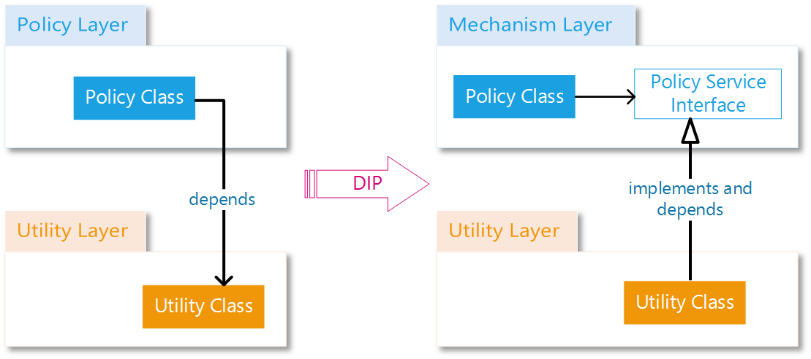
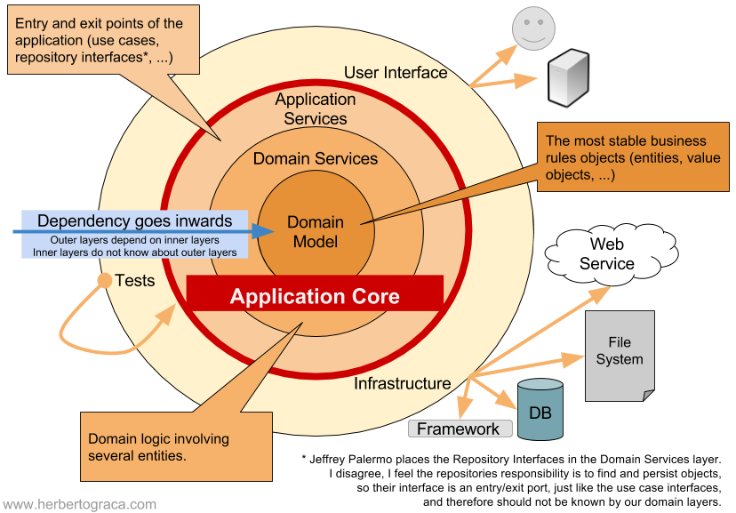

## What is architecture ?

- Yazılım mimarisi, bilginin bir yazılım sisteminde nasıl ilerlediğini belirleyen yapıdır.
- Yazılımın amacına ulaşması için nasıl organize edileceğini, ve hangi sırayla çalışacağını belirler.
- Mimariyi bütün uygulamayada uygulayabilirsiniz ve ya sadece bir parçasınada. Ya da client ve backend taraflarında farklı mimari yapılar bile kullanabilirsiniz.
- Mimariye örnekler; dosyaları organize ediş şekliniz, hangi paradigmayı kullandığınız(procedural, oop, functional), databasle direk bir etkileşim mi var yoksa soyutlanmış mı.

## Layers

- Layerlar, mimariden bahsederken sıkça duyacağımız bir terim. Layerlar, oop'de bir biriyle benzer işleri yapan sınıf grubuna denir.
- İyi bir yazılım mimarisinde layerlar bir birinden izole olmalı ve bağımlılığı düşük olmalıdır.

## Costs Of Poor Architecture

- **Untestable**.Kötü mimari genelde test edilemeyen kodlara sebeb olur.Buda bir birine sıkı bağlı(tightly coupled), izole edilemeyen bileşenler yüzünden olur.
- **Hard to refactor**. Yazılımda değişiklik, ve ya yenilik yapmak kabus haline gelir özellikle sisteminizin bozulmadığını garanti eden testleriniz de yoksa.
- **Impossible to upgrade**: Kullandığınız dili, frameworkü, kütüphaneleri güncellemeniz neredeyse imkansız hale gelir çünkü tamamen bağımlılar bir birine.

## Coupling, The Enemy

- Kötü mimarilerin temelinde coupling vardır. Coupling bir komponentin diğerine ne kadar bağımlı olduğunu ifade eder. Bir komponent bir başka component olmadan fonksiyonelliğini kaybediyorsa **highly coupled**, tam tersi durumda ise **loosely coupled**.
- Sıkı bağlı bir kodu refaktor etmek, tehlikeli bir işe dönüşebilir çünkü başka yerleri bozma ihtimaliniz yüksek.

Eğer bunları yapmayı seviyorsanız:

1. Kolayca refaktör etmek
2. Test yazmak
3. Yazdığınız kodu tekrar kullanmak

**Tightly coupling** sizin düşmanınız olmalıdır!

### Tamamda Nasıl Düşürecez Bağımlılığı

- **Have less dependencies**. Saçma gelsede bağımlılıkları düşürmenin en kolay yolu budur. Sınıflarımızın, metodlarımızın tek iş yapan kısa hallere getirmemiz, kompleks işlemleri sınıflara, metodlara bölerek, her sınıfın ihtiyacı olan bağımlılık sayısını azaltabiliriz.
- **Use Dependency Injection**. Bağımlılıkları sınıflarımızın dışında kolayca yönetmemizi sağlar.
- **Use Interfaces, not Concrete Classes.**. Olabildiğince bağımlılıklarımızın soyut tipler olmasını sağlamalıyız.
- **UseAdapters.** 3.parti bir koda bağımlı olmak yerine bunu dönüştürüp istediğimiz biçimde bize veren bir adapter'a bağımlı olmak daha mantıklıdır. Bu şekilde 3.parti kodlara sıkı bağlı olmadan kullanabiliriz.

## Design Patterns

- Yazılımda bilindik problemlerin çözümü için geliştirilen kanıtlanmış çözümlere design patterns denir.
- Dil spesifik değildir.
- GOF'un kitabında Creational, Structural ve Behavioral olmak üzere 3 kategoride toplam 23 tane bulunmaktadır.

### Factory

- Başka nesneleri yaratmak için kullanılan nesne.
- Bazı sınıflardan nesne oluştururken yapmamız gereken bazı bootstrap işlemler vardır biz bunları kodun her yerinde yazmak yerine bunu bizim için yapan bir factory sınıf oluşturabiliriz.

```php
class CustomerFactory {
  protected $accountManagerRepo;

  public function __construct(AccountManagerRepository $repo) {
    $this->accountManagerRepo = $repo;
  }

  public function createCustomer($name) {
    $customer = new Customer();
    $customer->setName($name);
    $customer->setCreditLimit(0);
    $customer->setStatus('pending');
    $customer->setAccountManager(
      $this->accountManagerRepo->getRandom()
    );

    return $customer;
  }
}
```

Factory pattern kullanmanın sağladığı yararlar:

1. **Reusable Code**. Bu tür bir nesneyi oluşturmamız gereken her yerde factory kullanarak tekrar kullanılabilirlik sağlamış oluruz ve kod tekrarlarından kaçınmış oluruz.
2. **Testable code.** Factoryler nesne oluşturma kodunun test edilmesini sağlar başka bir sınıfın içinde direk bu kodlar kullanıldığında test etmek imkansız olur.
3. **Easy to change.** Nesne üretme kodunuz değişeceği zaman bunu sadece bir yerden yapabilmenizi sağlar.

Yukarıda bahsi geçen factory, simple factory'dir. Gof tarafından belirtilen 2 factory pattern vardır bunlar:

1. Factory Method Pattern
2. Abstract Factory Pattern

#### Factory Method Pattern

Aynı interface ve ya abstract classtan türetilen sınıfların nesnelerinin oluşturulmasından sorumludur.

```c#
public enum VehicleType
{
    Car = 1,
    Truck = 2,
    Motorcycle = 3
}

public interface IVehicleFactory
{
    IVehicle ProduceVehicle(VehicleType type);
}

public class VehicleFactory : IVehicleFactory
{
    public IVehicle ProduceVehicle(VehicleType type)
    {
        IVehicle vehicle = null;
        switch (type)
        {
            case VehicleType.Car:
                vehicle = new Car();
                break;
            case VehicleType.Truck:
                vehicle = new Truck();
                break;
            case VehicleType.Motorcycle:
                vehicle = new Motorcycle();
                break;
        }
        return vehicle;
    }
}
```

#### Abstract Factory Pattern

Bir biriyle ilişkili ve ya alakalı farklı interface ve ya abstract classtan türetilen sınıfların nesnelerinin oluşturulmasından sorumludur.

### Repository

- Veri ile saklandığı yer arasındaki ilişkiyi belirten pattern. Aslında bir gof patterni değildir.
- Repolarda, genellikle veriyi getiren ve kaydeden metodlar bulunur.
- Repolar sadece bir nesneye referans etmeli. Verisini saklamak ve ya çekmek için kullanacağınız her nesne için ayrı repo yazılmalı. e.g. CustomerRepository, CommentRepository
- Repo, sınıfları oluşturmak için **ORM** frameworkleri kullanabiliriz ve ya kendi repomuzu yazabiliriz.

#### ORM

- ORM, bizim yerimize memory nesnelerimiz ile veritabanı tablolarımız arasındaki ilişkiyi sql yazmadan, basitçe kurmamızı sağlar.
- Performans gibi dezavantajlar yaratabilir.
- 2 Yaygın ORM Patternleri:
  1. Active Record:
     - Veritabanı işlemleri ile ilgilenme sorumluluğuda modelin kendisine verilir.
     - Basit ve öğrenmesi kolaydır.
     - Ancak modellerimizin veritabanı ile arasındaki ilişkinin **tightly coupled** olmasına sebeb olur.
     - Test etmesi zordur.
     - Performans sorunlarına yol açar yük artınca.
  2. Data Mapper
     - Data mapper daha enterprise bir çözümdür.
     - Business layer ile persistent layerını bir birinden ayırır ki bu iyi bir şeydir.
     - Data mapper'ın hazırlanması setupu active recorda göre daha zordur.
- Active record ortaya hızlıca ürün çıkarmak için tercih edilebilir. Ancak active record ile bir sınıf SRP'yi violate eder.

### Adapter

- Bir nesneyi belirtilen api'ye uyması için kapsayan obje. **Wrapper** pattern olarak da adlandırılır.
- Sınıflarımızın bağımlılıklarını loosely coupled yapmak için interfaceler ve ya abstract classlar kullanırız. Ancak 3.parti uygulamalarda bunu yapmamız mümkün olmadığı için bir adapter sınıf yazarız interface'i implement ederiz ve 3.parti uygulamayıda bu adapter sınıf içinde interface'imize uygun bir biçimde implemente ederiz.

### Strategy

- Encapsulates a behavior or a set of behaviors, allowing them to be used interchangeably.
- Diyelim ki uygulamamızda kullanıcı bir sipariş verdi ve biz onu bilgilendirmek için email ve ya sms atıyoruz.
- Biz bu bilgilendirme yöntemini ortak bir interface altında tanımlarsak daha sonraları email ve sms yöntemlerine ek olarak yöntemleri kolayca ekleyebiliriz.
- **Strategy pattern ile yöntemi seçerken kod bloğu içinde switch ve ya if kullanmak yerine de factory metodu kullanarak tekrar kullanılabilir ve test edilebilir kod yazmış oluruz.**

```php
class InvoiceDeliveryStrategyFactory{
    public function create(Customer$customer) {
        switch($customer->getDeliveryMethod()) {
            case'email':
                return newEmailDeliveryStrategy();
                break;
            case'print':
            default:
                return newPrintDeliveryStrategy();
                break;
        }
    }
}
```

```php
public function invoiceCustomers(array $customers) {
    foreach($customers as $customer) {
        $invoice=$this->invoiceFactory->create
        (
            $customer,
            $this->orderRepository->getByCustomer($customer)
        );

        $strategy=$this->deliveryMethodFactory->create($customer);
        $strategy->send($invoice);
     }
}
```

Tasarım desenleri, bizim daha okunabilir, ve temiz kod yazmamıza yardım eder.

## SOLID Design Principles

Solid prensipleri sınıflarımızın nasıl davranması, nasıl birbiriyle iletişime geçmesi ve organize olması gibi konuları tanımlar.

### Single Responsibility

SRP, bir nesnenin sadece bir amacı(sorumluluğu) olması gerektiğini söyler. Peki sorumluluk nedir ?

Robert C. Martin, sorumluluğu değişmek için bir neden olarak belirtir. Bir nesneye baktığımızda eğer o nesnenin değişmesi için birden fazla neden varsa SRP'yi ihlal eder. Bir başka yöntem ise onun davranışına bakmaktadır eğer birden fazla davranışı var ise yine ihlal ettiğini söyliyebiliriz.

```php
class InvoicingService {
    public function generateAndSendInvoices() {}
    protected function generateInvoice($customer) {}
    protected function createInvoiceFile($invoice) {}
    protected function sendInvoice($invoice) {}
}
```

Yukarıdaki sınıfın srp'yi ihlal ettiği açıkca gözlemlenmektedir. generateAndSendInvoices fonksiyonu isminden kendini belli etmektedir ancak her zaman bu şekilde isimden belli etmezler kendilerini kodun içine bakmadıkça. generateInvoice metodu mesela aynı zamanda faturayı oluşturduktan sonra yollamaktadırda.

#### SRP Neden Önemli ?

- Aynı nesne altında birden fazla sorumluluk bunları alakaları olmasa bile bir birine sıkı bağımlı yapar.
- Bu bir sınıfı bozmadan refaktor etmeyi zorlaştırır aksi taktirde sorumluluklar için farklı sınıflarımız olduğunda kodun diğer parçalarının çoğunu risklerden korur.
- Kodun daha kolay test edilebilmesini sağlar.
- Genel olarak küçük sınıfların refaktor ve test edilmesi daha kolaydır. Ve hata oluşturmaya daha az meyillidirler.

### Open/Closed Principle

- OCP, sınıfların değişime kapalı genişletilmeye açık olmalıdır.
- Strategy pattern, ocp'ye iyi bir örnektir. Yeni bir adaptör sınıf yazarak bir şeyi değiştirmeden genişletebiliriz.

#### OCP Neden Önemli ?

- Var olan bir kodu değiştirmek istenmeyen yan etkilere ve problemlere neden olur. Ancak genişletildiği taktirde ortaya çıkacak risklerden korumuş oluruz.

### Liskov Substition Principle

- LSP, aynı interface'e sahip concrete sınıflardan hangisi kullanılırsa kullanılsın programın nihayi davranışı değişmemeli hepsi aynı davranışı göstermelidir.
- Concrete sınıfların tabi ki implementasyonları farklı olabilir ancak sonuç olarak hepsinin beklenenin dışında bir davranışa sahip olmaması gerekir aksi taktirde farklı implementasyonlarda istenmeyen yan etkiler ve sorunlar ortaya çıkar.
- LSP, ile OCP bir birini tamamlayan prensiplerdir.

#### LSP Neden Önemli ?

- LSP, kolayca refaktor edilebilen kodlar yazabilmek için önemlidir.Var olan hiçbir kodu modifiye etmeden uygulamamızı zenginleştirmemizi sağlar.

### Interface Segregation Principle

- ISP, sınıfların ihtiyacı olmayan metodları implemente etmek zorunda olmamalarını savunur.
- Bu genellikle, fat interfaceler yüzünden oluşur. Uygulamanızı genişletmek için yeni bir adapter yazdığınızda bu interface içinde eğer bu sınıfın ihtiyacı olmayan metodlar var ise bu interface'de, interfacenizi parçalamanız lazım demektir.
- Bu prensip aslında interfacelerin SRP'ye uyması gerektiğini söyler.

#### ISP Neden Önemli ?

- Interface'in implementasyonunu kullanan bütün client kodlar bu interface'in bütün metodları ile coupled hale gelir ister kullansın ister kullanmasın.**ISP'nin amacı decoupled kod yazmayı sağlamaktır.**

### Dependency Inversion Principle

- DIP, High level modüllerin, low level modüllere bağımlı olmaması gerektiğini söyler. Bunun soyutlamalarla yapılması gerektiğini söyler.
- Farklı layerlardaki sınıfların bir biri ile bağımlılıklarının soyut sınıflarla yapılması gerekiyor. Bu şekilde low level bir yerde değişiklik yaptığımızda buna depend olan diğer yerlerin daha az etkilenmesini sağlarız.

#### Ornek

- Business layer high level bir layerdır, data access layer ise sadece verinin nasıl getirileceği ve saklanacağı ile alakalı detayları içerir.
- Bu yüzden business layer, data access layerına depend olmamalı. Peki bunu nasıl sağlarız ?
- Business layer'da veri saklama ve getirme işlemleri için bir contract yani interface oluştururuz ve bizim business layer sınıflarımız ihtiyacı olduğunda buna depend olmalıdırlar. Bu sayede business layerımız, data access layerımıza bağımlı olmamış olur.



#### DIP Neden Önemli ?

- Decoupled codebaseler oluşturmak için, bağımlılıkların sadece tek bir yönde olması ve bu yönünde içe doğru olması gerekmektedir.
- DIP, ile contractların yani interfacelerin sorumluluğunu high level layer almış olur ve sorumluluğun değişmesi ile bağımlılığın yönü de değişir artık low level layer, high lavel layera depend olur çünkü contract(interface)'ın kontrolü high level layerın elindedir artık.
- Ek olarak sözleşmeler dal'da olsa bile dip'a uyabiliriz. Bu da sözleşmelerin implementasyona bağımlı olmaması ile sağlanır. Tabi birinci durum daha tercih edilir bir pratiktir.



## Dependency Injection

- OOP'de couplinge yol açan en sık rastlanan nedenlerden biri, bir sınıftan nesne üretiminin bir başka sınıf içinde direk yapılmasıdır.
- Bunu kolayca sınıf içerisinde new anahtar sözcüğünü aratarak bulabiliriz.

```php
class CustomerController {
    public function viewAction() {
        $repository = new CustomerRepository();
        $customer = $repository->getById(1001);
        return $customer;
    }
}
```

- Yukarıda örnekte CustomerController sınıfının, CustomerRepository sınıfıyla arasındaki bağımlılık sıkıdır(tightly coupled). Yani CustomerController sınıfı, CustomerRepository sınıfı olmadan çalışmaz.

**Bu şekilde nesne oluşturmanın bazı kötü yanları vardır:**

1. **Değişiklik yapmayı zorlaştırır.**
2. **Test yazmayı zorlaştırır.** CustomerController sınıfı için birim testi yazmaya kalktığımızda içindeki CustomerRepository de test kapsamına girmiş olur buda birim testten çıkar integration testine girer çünkü buradaki CustomerRepository sınıfı veritabanı işlerini üstlenen sınıftır. Coupling, komponentleri izole bir şekilde test etmeyi zorlaştırır.
3. **Bağımlılıklar üzerinde kontrolümüz yoktur.** Bir bağımlılığımızın farklı şartlarda farkı bir şekilde oluşturulması gerektiğini düşünelim bunu ona bağımlı sınıfların içinde yapmak kullanışsız bir pratiktir.

Bu sebebler büyük problemlere yol açabilir özellikle büyük projelerde. Bu geliştiricilerin ileride küçük bir değişiklik yapmasını bile engelleyebilir.

## Inversion Of Control

- IOC, bağımlılıkların oluşturulması ve konfigüre edilme işlemlerini bağımlı olan sınıftan alıp harici bir araca verme işlemidir.
- Harici araçlardan en popüler iki tanesi şunlardır: the service locator pattern, dependency injection.

## Örnek Uygulama Adımları

1. İlk önce domain model layerını oluşturuyoruz. Burada hiçbir şeye bağımlılığı olmayan sınıflarımız olacaktır.
2. Entitiylerimizin hepsinde id değişkeni olacağı için abstract bir class yazacağız id değişkeni olan ve diğer entitylerimiz bunu extends edecekler.
3. Domain model sınıflarımız için test yazmıyoruz çünkü bunlar sadece getter ve setter metodlara sahip, ve eğer bir problem oluşacaksa muhtemelen burada olmayacaktır.
4. Sıradaki layerımız domain services. Domain service katmanı sadece domain modal katmanına bağımlı olabilir.
5. Bu katmanda; repository interfacelerimiz, factorylerimiz ve servis sınıflarımız olacak.
6. BDD yöntemi ile InvoiceFactory sınıfımızı ve metodu yazıp implementasyonunu bırakıyoruz ve testlerini yazıyoruz fail eden testlerden beklediğimiz davranışları sınıfımızda implemente ediyoruz.

### Kaynaklar

1. https://www.thoughtfulcode.com/orm-active-record-vs-data-mapper/
2. https://oncodedesign.com/dependency-inversion-and-assemblies-references/
3. https://herbertograca.com/2017/09/21/onion-architecture/
