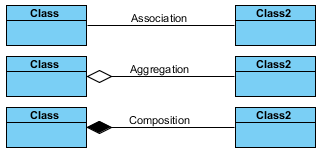

# Associations

Assoication, ilişki ortaklık demektir.

Bir hayvan ve köpek örneği üzerinden gidelim.

- Evcil hayvan sahibi, hayvanı besler.(Association)
- Kuyruk, köpek ve kedilerin bir parçasıdır (Aggregation / composition).
- Kedi, bir tür evcil hayvandır. (Inheritance / Generalization)

### UML Gösterimleri

## Association

İki model aralarında iletişim kurabilmek için, aralarında bir bağlantı olması lazım ve buna association denir.

Düz bir çizgi ile belirtilir ve iki yönlü bir hattır.

Aggregation ve composition association'ın alt kategorileridir.

## Aggregation (Has-a)

- Association'ın özel bir formudur.
- Sahiptir ilişkisi kurar modeller arasında.
- Tek yönlü bir ilişki mevcuttur. Misal okulların öğrencileri vardır ancak tersi geçerli değildir.
- Güçlü bir bağlantı yoktur, biri olmadan da diğeri varolabilir.

## Composition (Part-of)

- Association'ın özel bir formudur.
- Parça ilişkisi kurar.
- Bir birini tamamlarlar, güçlü bağları vardır.
- Biri, diğeri olmadan varolamaz.
- Kalp ve insan örneği composition için bir örnek olabilir.

## Generalization / Inheritance

- Benzer davranışları ve fieldları olan sınıfları daha genel bir sınıf olarak tanımlamaktır.
- Bu genel sınıftan daha spesifik, özel sınıflar türetilir.
